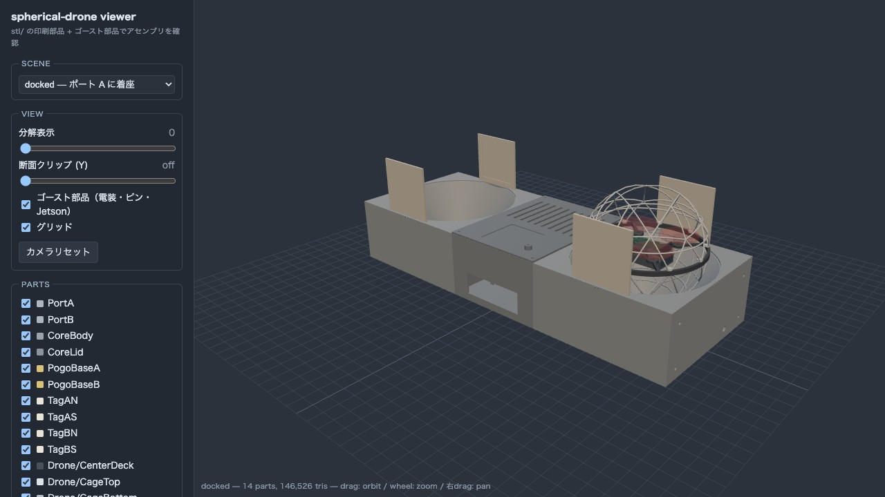
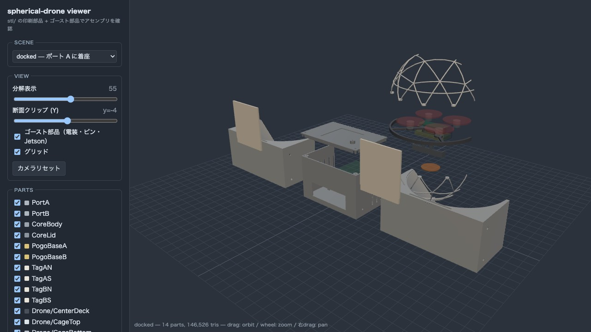

# spherical-drone assembly viewer

viewer は repo-root の `/viewer/` に統合された。起動と使い方は以下を参照:

```sh
viewer/serve.sh          # リポジトリルートから起動。= python3 -m http.server 8642
# → http://localhost:8642/viewer/
```

PROJECT ドロップダウンで「Spherical Drone」を選ぶとこのプロジェクトのアセンブリが表示される。
機能（SCENE 切替・分解表示・断面クリップ・ゴースト・PARTS 表示切替）や manifest スキーマは
`../../../viewer/README.md` を参照。

このプロジェクト固有の配置・ゴーストデータは `../viewer.json` に定義されている。

## スクリーンショット

| docked | 分解 + 断面 |
|---|---|
|  |  |
